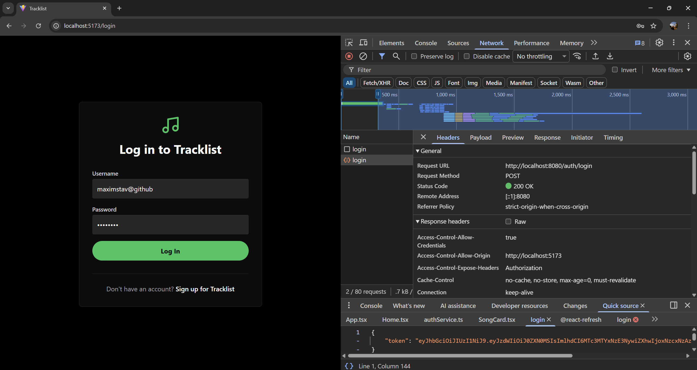
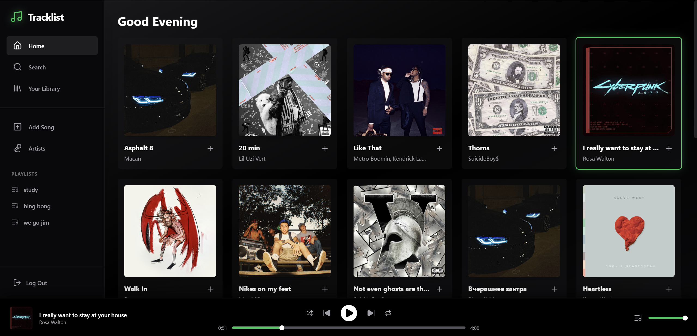
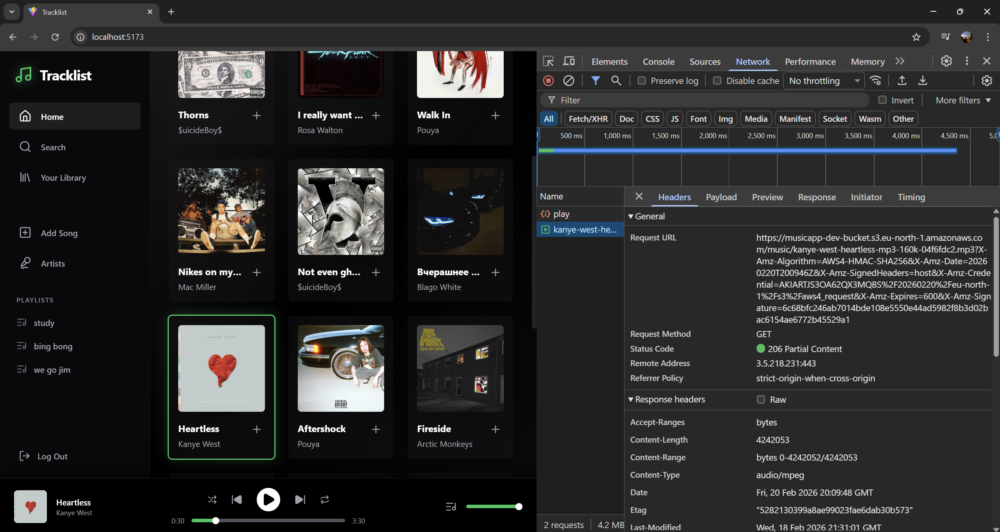
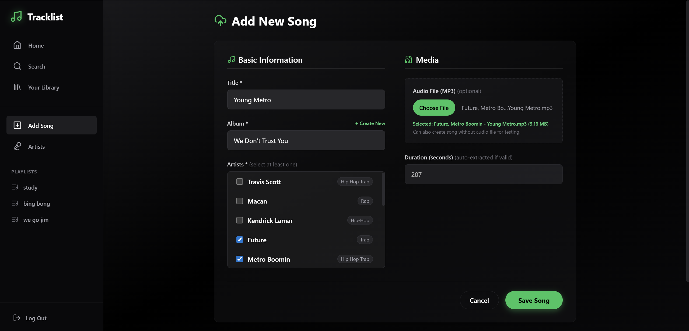
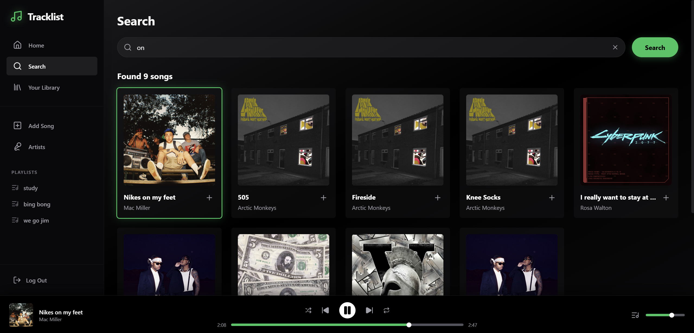
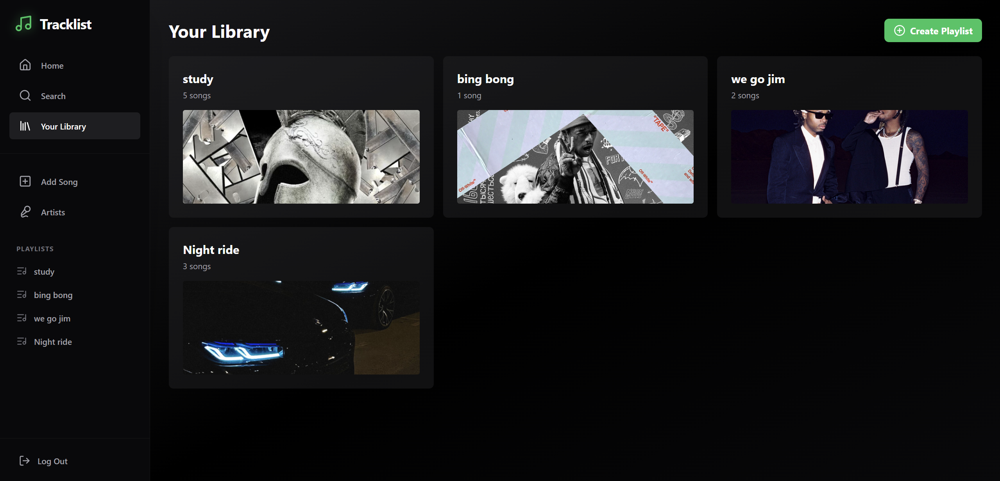

<h1 align="center">Tracklist 🎧</h1>

<p align="center">
  <strong>A production-ready, full-stack music streaming platform.</strong>
</p>

<p align="center">
  
  
  
  
</p>

---

## � Demo / Preview

> *These previews demonstrate the frontend client actively consuming the backend REST API, handling JWT sessions, and streaming media via S3.*

| | |
|:---:|:---:|
|  <br/> **1. Stateless JWT Auth Flow** |  <br/> **2. Complex Relational Data Retrieval** |
|  <br/> **3. S3 Presigned URL Media Streaming** |  <br/> **4. Direct-to-S3 Upload Flow** |
|  <br/> **5. Unified JPA Catalog Search** |  <br/> **6. Playlist State Persistence** |

---

## �📖 Project Overview

**Tracklist** is a comprehensive, full-stack music streaming application designed to demonstrate robust backend engineering, secure media delivery, and a dynamic, responsive user interface. 

The project emphasizes **scalability, clean architecture, and modern best practices**, serving as a showcase of a production-ready system capable of handling complex relational data, authenticated user sessions, and large media files efficiently.

> **Note:** The core technical strength of this project lies in the **Backend API**. It features advanced entity mapping, stateless JWT authentication, and offloads heavy media streaming directly to AWS S3 using short-lived Presigned URLs.

---

## 🏗️ Project Structure

This repository is a monorepo containing two distinct applications:

```text
/
├── musicapp_backend/   # Core REST API (Java / Spring Boot)
└── music-frontend/     # Client Web App (React / Vite)
```

### 1. The Backend (`/musicapp_backend`)
The brain of the platform. A highly scalable REST API built with **Java 21 and Spring Boot 3**. 
- **Roles:** Handles identity (JWT), business logic, complex database queries, and S3 integration.
- **Highlights:** Employs a Controller-Service-Repository pattern, RFC 7807 unified error handling, and robust entity modeling (Users, Songs, Albums, Artists, Playlists).
- 📄 **[Read the deep-dive Backend README here](./musicapp_backend/README.md)**
- 📄 **[View the full API Documentation here](./musicapp_backend/API_DOCUMENTATION.md)**

### 2. The Frontend (`/music-frontend`)
The client consumption layer. A modern Single Page Application built with **React 19, TypeScript, and Vite**.
- **Roles:** Consumes the REST API, manages user sessions, and provides a sleek media player interface.
- **Highlights:** Uses TailwindCSS for styling, `react-router-dom` for navigation, and `@dnd-kit` for drag-and-drop queue management.

---

## ✨ Key Features

- **Secure Media Delivery:** The backend grants temporary S3 Presigned URLs to the frontend, allowing secure, direct-to-client audio streaming and image rendering without bottlenecking the backend server.
- **Stateless Authentication:** JWT-based user authentication and role-based access control.
- **Advanced Unified Search:** Dynamically searches across Songs, Albums, and Artists via a single optimized API endpoint.
- **Drag-and-Drop Queue Management:** Users can reorder their listening queue effortlessly on the frontend.
- **Complete Media Lifecycle:** End-to-end flows for creating albums, uploading cover art, adding songs, and managing personal playlists.

---

## 🛠️ Technology Stack

### Backend Infrastructure
- **Language:** Java 21
- **Framework:** Spring Boot 3.5.6 (Web, Data JPA, Security)
- **Database:** MySQL 8.0
- **Storage:** AWS S3 (AWS SDK for Java)
- **Security:** Spring Security, JJWT (BCrypt password hashing)

### Frontend Client
- **Core:** React 19, TypeScript
- **Build Tool:** Vite
- **Styling:** Tailwind CSS, PostCSS
- **State & Routing:** Context API, React Router v7
- **Utilities:** Axios (API calls), Lucide React (Icons), dnd-kit (Drag and drop)

---

## 🚀 Running Locally

To run the full stack locally, you need two terminal windows: one for the backend and one for the frontend.

### Prerequisites
- **Java 21**, **Maven**, and **Node.js** (v18+)
- **MySQL 8.0** running locally.
- An **AWS Account** with an S3 bucket configured for CORS.

### Step 1: Start the Backend

1. Create a local MySQL database named `musicapp` and grant privileges to a user `musicappuser` with password `password` (or update `application.properties` to match your local setup).
2. Set your environment variables:
   - `JWT_SECRET` (A secure base64 string)
   - `AWS_ACCESS_KEY_ID`
   - `AWS_SECRET_ACCESS_KEY`
3. Navigate to the backend directory and run:

```bash
cd musicapp_backend
mvn clean install
mvn spring-boot:run
```
*The API will start on `http://localhost:8080`.*

### Step 2: Start the Frontend

1. Navigate to the frontend directory:
```bash
cd music-frontend
```
2. Install dependencies:
```bash
npm install
```
3. Start the development server:
```bash
npm run dev
```
*The React app will be available at `http://localhost:5173`.*

---

*For professional inquiries, networking, or architectural discussions, feel free to reach out via GitHub or LinkedIn.*
